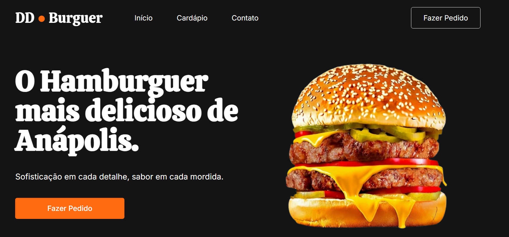

📸 Prévia do Layout

🍔 DD Burguer - Landing Page :
Bem-vindo ao repositório do DD Burguer!  
Este é um projeto de uma landing page moderna e responsiva para uma hamburgueria artesanal localizada em Anápolis.  
O objetivo principal deste projeto foi aplicar conceitos avançados de HTML5 e CSS3, com foco total em Flexbox para o layout.

🚀 Sobre o Projeto:  
DD Burguer foi desenvolvido para oferecer uma experiência visual atraente e funcional para os clientes. A página conta com uma seção Hero de impacto, navegação intuitiva e total adaptação para dispositivos móveis.

🚀 Tecnologias Utilizadas Para este projeto:  
Utilizei as tecnologias web fundamentais para garantir performance e semântica:

- HTML5
- CSS3
- Flexbox
- Google Fonts
- Git e GitHub

🎨 Funcionalidades:  
Layout Responsivo  
Seção Hero  
Menu de Navegação  
Design Moderno

🤝 Contribuição
Sinta-se à vontade para abrir uma Issue ou enviar um Pull Request com melhorias! 
Todo feedback é muito bem-vindo para o meu crescimento como desenvolvedor.

👤 Desenvolvido por Eduardo Dias (edudiaspf18).

